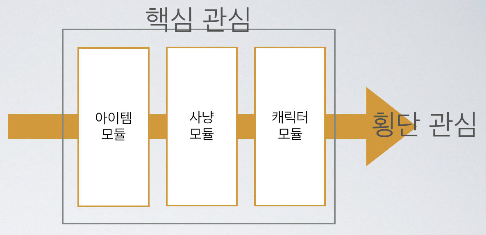

* * * 
# 관점 지향 프로그래밍 AOP
Programtype Dir 에서는 프로그래밍 패러다임인 객체 지향과 절차형 프로그래밍에 대해서 알아보았다. 하지만 새로 등장한 AOP에 대해서 알길이 없기에 
이번에 한번 AOP에대해 다뤄 보고자한다.

* * *

## AOP의 개요
프로그래밍 언어에서 PP(Procedural Programming)은 Procedure를 통해, OOP는 클래를 통해 부닐된 관심과 개념들을 통해 모듈로 분해했다. 앞선 
[내용](https://github.com/bradykim7/JuniorPreparing/blob/master/programtype/2_1.md)에서는 OOP가 프로그래밍의 발전을 통해
다양해지고, 복잡해짐을 대응하기 위해서 등장한 개념이라고 이야기했다. 하지만 OOP를 적용한다고 충분히 분리해 낼 수 없는 부분을 해소하고자 AOP의 개념이 생기게 된다.

## 관점 지향 프로그래밍(Aspect Orietned Programming) 이란?
> 기능별로 CLASS를 분리했음에도 불고하고 쌩기는 중복코드의 단점을 해결하고자 나온 방식, 공통기능과 핵심부분을 분리하여, 필요할 때만 공통기능을 핵심부위에 넣어주는 방식

조금더 심화하여 이를 개념화 하면, 횡단 분할 기법(Seperation of cross-cutting concerns)을 사용하여 모듈성을 증가시키는 것이 목적인 프로그래밍 패러다임이다.

횡단 분할 기법(Seperation Of Cross-cutting Concerns)란, OOP와 같은 모듈화가 용이한 방법을 사용하더라도 결코 쉽게 분리된 모듈로 작성하기 힘든
요구싸항이 실제 어플리케이션 설계와 개발에서 자주 발견된다는 점이다. 이를 AOP 관점에서 횡단 관심이라고 한다.

기능을 핵심 비즈니스 로직과 공통 모듈로 구분하고, 핵심 로직에 영향을 미치지 않고 사이사이에 공통 모듈을효과적으로 잘 끼워놓도록 하는 개발 방법이다.

공통 모듈(보안인증, 로깅 같은 요소등 )을 만든 후에 코드 밖에서 이 모듈을 비즈니스 로직에 삽입하는 것이 바로 AOP적 개발이다. 코드 밖에서 설정된다는 것이 핵심이다.

</img>

예를 들어 MMORPG게임을  AOP로 설계하는 예를 만들어 보겠다.

핵심관심, 즉 클래스화 되어있어서 구현되어야할 기술들은 아이템, 사냥, 케릭터, 맵등 여러 핵심관심들이 있다. 하지만 핵심에서 살짝 벗어나 보안에 관련된 부분들 
가령 매크로를 가려낸다던가 하는 부분은 필요가 없을 것인가? 당연히 필요하다. 자동 판매나 자동 사냥 매크로등은 아이템이나 사냥 모듈등 여러 핵심 관심 등에 걸쳐서 필요한 모듈이다.

또 로그 처리라던가 DB와 연동되는 것은 어떠할까? 이러한 부가적인 기능들가지 핵심기술에 나눠서 클래스에 작성할 수 있지만, 이것들이 호출되고 사용한느 코들들이 
핵심 모듈 안에 모두 포함시킬 수 밖에 없다.

한마디로 아이템 모듈 안에 매크로 감지 보안 모듈을 넣어놔야하고 , 사냥 모듈에 매크로 감지 보안 모듈도 매크로 감지 보안 모듈을 넣어야하는 번거로움과 코드 수정시
일일이 하나식 해당 모듈들을 찾아 수정해야하므로 시간이 낭비되는 문제가 발생한다.

핵심은, 위의 그림에서 처럼 아이템, 사냥, 캐릭터 등이 될 수 있고, 횡돤 관심은 보안, 통계, DB 등의 그밖의 것들을 이야기한다. 이처럼 흩어진 호이단 관심사들을
Aspect로 모듈화 하고 , 핵심 관심에서 분리하여 재사용한다는 것이 AOP의 취지이자 핵심이다. 

## AOP의 주요 개념

- Aspect : 부가기능 모듈을 일컫는 단어로 , 핵심긴으에 부가되어 의미를 갖는 특별한 모듈
- Target : Aspect를 부여할 대상을 말한다.
- Advice : 실질적으로 부가기능을 담은 구현체
- JoinPoint : Advice가 적용될 위치, 다른 AOP 프레임 워크와 달리, Spring에서는 메소드 조인포인트만 제공
- PointCut : JoinPoint의 상세한 스펙을 정의함을 정의함으로써 Advice가 실행될 지점을 정할 수 있다.

Spring AOP의 특징

- Spring에서 AOP구현은 접근 제어 및 부가 기능을 추가하기 위해서 Proxy를 이용한다. 이 때문에 다른 AOP의 기능과 비교해서 매우 제한적인 부분만을 지원한다.
- Spring 내에 Proxy Bean에서만 AOP를 적용 가능하다. 설정 구조 상 다른 XML기반의 AOP에 비해 복잡한 편이다.
- 모든 AOP 기능을 제공하는 것이 아닌 Spring IOC(Inversion of Control)와 연동하여 엔터프라이즈 애플리케이션에서 가장 흔한 문제에 대한 해결책을 지원하는 것이 목적이다.

## AOP를 사용하는 경우

1. 간단한 메소드 성능 검사
    - 개발 도중 특히 DB에 다량의 데이터를 넣고 빼는 등의 배치 작업에 대해, 시간을 측정해보고, 쿼리를 개선하는 작업은 매우 의미가 있다. 이 경우 매번 해당 메소드 처음과 끝에
    System.currentTimeMills(); 를 사용하거나, Spring이 제공하는 StopWatch 코드를 사용하기는 매우 번거롭다. 이런 경우, 해당 작업을 하는 코드를 밖에서 설정하고, 해당 부분을 사용하는 편이 
    편리하다.    
2. 트랜잭션 처리
    - 트랜잭션의 경우 비지니스 로직의 전후에 설정 된다. 하지만 매번 사용하는 트랜잭션(try catch 부분)의 코드는 번거롭고, 소스를 더욱 복잡하게 보여준다.
3. 예외 반환
    - Spring에는 DataAccessException 이라는 예외 계층 구조가 존재한다. 이전의 하이버네이트 예외들은 몇개 없었으나, 잘 정의되어있는 예외 계층 구조를 변환해서 
    다시 전달한느 Aspect는 제 3의 프레임워크를 사용할때, 본인의 프레임워크나 어플리케이션에서 별도의 예외 계층 구조로 변환하고 싶을 때 유용하다.
4. 아키텍처 검증
5. 기타
    - 하이버네티스와 JDBC를 사용할 경우의 DB동기화 문제 해결
    - 멀티스레드 Safety 관련하여 작업해야 하는 경우, 메소드를에 일괄적으로 락을 설정하는 Aspect
    - 데드락 등으로 인한 PessimisticLockingFailuerException 등의 예외를 만났을 경우, 재시도하는 Aspect
    - 로깅, 인증, 권한 등등             