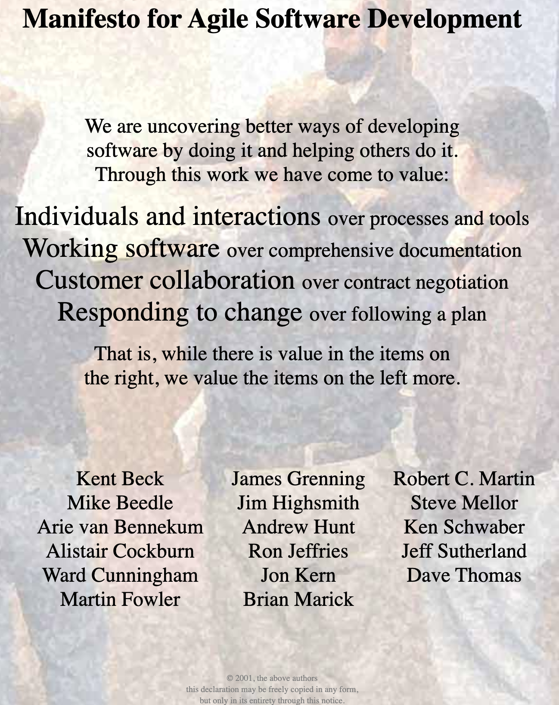

* * * 
# Agile , TDD , BDD

* * *

## Intro
클린 코드나 리펙토링 관련 서적을 읽으면서 자주 등장하는 개념이고, 다른 개발 블로그들을 둘러봐도 'Agile'한 작업 환경, TDD, BDD 라는 용어를 많이 
접할 수 있다. 가장 먼저 눈에 띄는 것이 TDD인데, TDD에 앞서, Agile Sotfware Development가 무엇인지 알아보자. Agile을 고민하다가 파생된 것이
TDD이기 때문이다. TDD 외에도 많은 방법들이 존재하지만, 방법을 살펴 보기 앞서, Agile 한 작업의 의미가 무엇을까? 

## Agile Methodology
</img>

> 에자일 소프트웨어 개발 선언
<pre>
우리는 소프트웨어를 개발하고, 또 다른 사람의 개발을 도와주면서 소프트웨어 개발의 더 나은 방법들을 찾아가고 있다.
이 작업을 통해 우린느 다음을 가치있게 여기게 되었다.
    하나, 공정과 도구보다 개인과 상호작용을
    하나, 포괄적인 문서보다 작동하는 소프트웨어를
    하나, 계약 협상보다 고객과의 협력을
    하나, 계획을 따르기보다 변화에 대응하기를 가치있게 여긴다.
    이 말은, 왼쪽 또한 가치가 있지만, 오른쪽에 더 큰 가치를 둔다.
    
    Kent Beck, Mike Beedle, Arie van Bennekum, Alistair Cockburn, Ward Cunningham, Martin Fowler,
    James Grenning, Jim Highsmith, Andrew Hunt, Ron Jeffries, Jon Kern, Brian Marick, Robert C. Martin
    Steve Mellor, Ken Schwaber, Jeff Sutherland, Dave Thomas
</pre>  

Agile Methodology Declaration 살펴보면 다음을 추론 할 수 있다.
- 에자일 방법롭은 하나의 개발 모델이 아니라 여러개의 개발 방법론이 있는 개발 방법론 집합체의 원칙에 가깝다.
- 90년대 중반 기존의 무겁고 규범적인 방법론에서 탈피하여 가벼운 방법론을 지향하며 등장하였다.
- 에자일 프로그래밍은 기존의 계획과 문서에 의존하는 방식을 부정하고 미래에 대한 예측을 차단하고 지속적인 프로토타입의 완성을 반복하여, 
지속적으로 요구사항을 추가하고, 문제점을 해결하여 점차적으로 큰 규모의 소프트웨어를 완성하는 개발 방식이다.

Agile 은 **컴퓨터 환경과 시대가 변화함에 따라서 기존의 Waterfall Model 방식으로는 한계점이 존재했고, 한계점 극복을 위해 개발과 함께,
피드백을 통해 유동적으로 개발하는 방법롭을 제시한다.**

**유연하게 일하는 방식** 이다, 기획, UI/UX, Design, Development, Modifying의 순서대로 일이 진행되고, 다시 되돌아 갈 수 없도록 일하는 
방식을 Waterfall Model이라고 불렸고, 과거에는 이런식으로 프로젝트가 진행 되었다. 클라이언트의 요구사항이 유동적으로 계속 변하지 않고, 마지막 프로젝트의
완성본이 너무나도 명확하다면 Waterfall Model은 너무나도 효율적이지만, 현실은 **아니다**.

특히 현대에 이르러 , 각종요구와 개발하는 방식이 많아진 지금은 더더욱 Waterfall Model로는 명확한 한계점이 보인다는 것이다. 따라서, 하나의 프로토타입 단위로
쪼개서 테스트 코드를 작성하고, 클라이언트의 즉각적인 피드백을 받아서 수정하고 실수와 오차를 줄이며 진행해나가는 방식인 애자일 방식이 각광받고 널리 알려지게 된것이다.

애자일 자체로는 어떤 개발 모델이 아니라 , 방법론의 집합체, 규약과도 같은 것이라고 앞서서 말했다. 그래서 단순히 이 애자일을 제한적으로 프로그래머에게만 해당하는
내용이라고 생각한다면 애자일의 근본 개념과도 위배된다. 따라서 모든 직무에서 에자일하게 일하는 방법을 적용할 수 있다.

EX )  Kanban, TDD, BDD, Distributed Agile, Pair Programming, Scrum etc ...

## Kanban
</img>

Kanban 은 TDD나 BDD보다 훨씬 시각적이고, Trello, Notion과 같은 협업툴에서 제공하는 Kanba Board에 익숙하다면, 내가 실제로 프로젝트를 진행했을 때,
사용한 위의 사진을 보고도 단번에 이해할 수 있다. 

</img>

Kanban은 연속적 흐름 처리 방식이다. Kanban Board로 시각화 하고 각각 단계마다 열로 표시한다. 이 때, 열은 우선순위가 높다면 위로, 낮다면 아래로 배치한다.
이들 이슈는 SwimLane 이라고 불리는 행으로 진행 상황을 알 수 있다.

Kanban 의 핵심은 진행 중인 WIP(Work-In-Process)이 동시에 개발이 진행 될 수 있는 아이템의 수를 제한하는 것이다. 관리자는 이 WIP에 여유가 있을 때만 작업을 
왼쪽에서 오른쪽으로 당길 수 있다. Kanban은 이렇게 동시에 처리할 수 있는 이슈의 수를 제한함으로써 생산성을 제어한다.
위의 사진을 예로 들면, Doing에 WIP 제한을 3개로 둔다면 Doing에서 Done으로 옮기지 않는 이상, TODO의 내용을 Doing으로 옮길 수 없다.

- 장점
    + 흐름을 시각화 할 수 있다.
    + 일일 스탠드업, 데모, 레트로스펙티브와 같은 오버헤드 활동에 시간을 덜 소비할 수 있게 해준다.
- 단점
    + 애자일을 새로 접하는 팀에 어려움을 줄 수 있다.(프로세스에 대한 정확한 설명 부족)
    + 좋지 않은 프로세스로 무기한으로 빠지기 쉽다.
        
## TDD
> Test the program before you write it -Kent Beck-

Kent Beck은 2003년에 TDD가 단순한 설계를 장려하고 자신을 불어 넣어준다고 말했다.

TDD는 Test Driven Development의 약어로 말 그대로 테스트 주도의 개발을 의미한다. 테스트로 이끌어가는 개발 환경, 작업을 표현할 때 주로 
사용되는 표현이며, 쉽게 말해 구현코드를 작성하기 전에 테스트부터 만든다는 것이다.

**선 테스트코드 , 후 구현 이다.**

소프트웨어 개발 프로세스 중에서 TDD
1. 요구사항을 검증하는 Test Case를 작성한다.
2. Test Case를 통과하기 위한 최소한의 코드를 생산.
3. 작성한 코드를 표준에 맞게 Refactoring 한다.

테스트 코드를 작성한다는 것이 무엇을 어떻게 하는지 감이 안 올 수 있는데, 그 이전에 가장 먼저 염두해 두어야 할 것은 내가 지금 만들려고 하는 코드가 
어떠한 결과를 만들어 낼 것인지를 인지하고, 그 결과가 올바르다면 어떤 결과를 낳을지 예상하고, 그 결과를 통과해야하는 TestCase를 구현하고, 제대로 돌아가는 것을 
확인하는 과정이다.

- 장점
    + 코드의 확장성 및 유지보수 용이해진다.(코드의 모듈화가 자연스럽게 이루어진다.)
    + 프로그램 소스코드 기록(테스트 코드로 인해서 코드의 목적성과 과정을 기록하는 효과)
    + 총 소유 비용(TCO) 절감
- 단점
    + 숙련되기 전까지 다소 시간이 소요
    + 선행 투자가 많이 필요하다.    
    

## BDD

BDD는 Behavior-Drive Development의 약자로, 행위 주도개발이라고 불린다. 기본적으로 TDD에 기반을 두고 있으며 겉보기에는 큰차이가 나지 않는 것 같지만
BDD는 TDD에서 한발 더 나아가 테스트 케이스 자체가 요구사항이 되도록 하는 개발 방식이다.

Dan North는 TDD를 코칭하던 시절, Test라는 단어가 사용하지 않는 편이 TDD를 이해하는데 더 쉽다고 생각하고, Test보단 Behavior에 초점을 둔다.
그는 Test Method의 네이밍을 "어떤 것을 해야만하는지(should do Something"이라는 문장으로 작성하여 행위에 대한 테스트에 집중할 수 있었다.

TDD는 테스트를 작성하고, 그 테스트를 통과하는 코드를 작성하는 흐름을 기본으로 작성하지만, 함수 단위로 테스트 단위를 정하여, 작성한다면 모든 함수가
테스트 대상에 포함 되어야 함으로 현업에서 다소 번거로움을 느낄 수 있다.

그래서 TDD에서 파생되어 등장한 BDD는 함수 단위의 테스트를 권장하지 않고 시나리오 기반의 테스트 케이스를 작성한다. 이 때, 이 시나리오는 개발자가 
아닌 사람이 보아도 이해할 수 있는 정도여야한다. 하나의 시나리오는 Given, When, Then구조를 가진다.

- Feature : 테스트에 대상의 기능/ 책임을 명시한다.
- Scenario : 테스트 목적에 대한 상황을 설명한다.
- Given : 시나리오 진행에 필요한 값을 설정한다.
- When : 시나리오를 진행하는데 필요한 조건을 명시한다.
- Then : 시나리오를 완료했을 때 보장해야 하는 결과를 명시한다.

- 장점 
    + 비즈니스에서 요구하는 가치를 제공한다.
    + 다른 커뮤니티 구성원들도 참여 할 수 있다.
- 단점
    + BDD를 지원하는 소프트웨어 툴은 비교적 적다.
       

## TDD, BDD What's the dirfference ?

테스트 프레임워크(OOOunit Series)를 쓴다고 해서 전부 TDD는 아니다. 오히려 프레임워크를 사용해서 자신의 코드를 완성 후에 테스트 코드를 
짜고 이르 ㄹ돌렸다면 이것은 TDD보다 BDD에 가깝다. 코드의 완성 과정에서 테스트가 영향을 주지 않았다면 이는 테스트 케이스 자체가 요구사항이 되기 때문이다.

TDD는 개발 코드의 완성이 목적이고, BDD는 개발 결과의 검증이 목적이다.

조그만한 개발팀에 있고 일하는 대상이 모두 개발자라면 굳이 BDD를 사용할 이유가 없다. 왜냐하면 BDD는 TDD사용자들의 공식화된 좋은 습관들 위에
형성되었기 때문이다. 하지만 BDD는 개발자의 언어로 이루어지는 TDD와 비교하여 시나리오를 읽는 대상이 좀더 넓혀진 개념이다.

쉽게 요약한다면 TDD는 코드 자체에 집중한 테스트 코드를 작성; BDD는 시나리오를 패턴화 하여 여러 구성원들이 테스트 코드를 검증할 수 있도록하여
비즈니스 요구사항을 빠르게 반영할 수 있다.