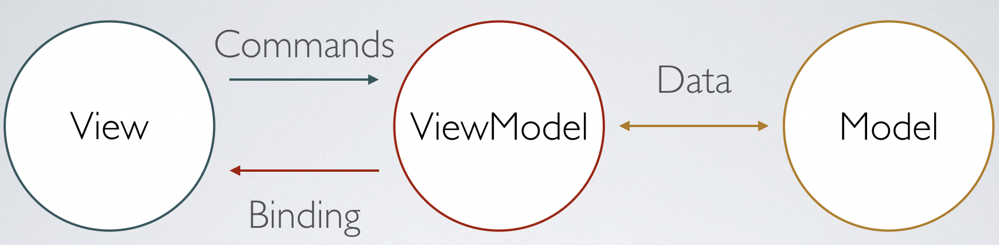

* * * 
# MVC ? 싱글톤 ? 여러가지 디자인 패턴들

* * *

## 디자인 패턴의 개요
여러가지 사람이 협업하여 프로그램을 개발 할때, 다른사람이 작성한 코드나, 기존의 코드를 이해하는데에는 많은 시간이 소요되고, 어렵다. 이런 코드들을 
유지 보수함에 있어서, 새로운 기능을 추가하거나 최적화하기에 힘든구조적인 결함을 가지고 있다. 이를 최소화하기 위해 디자인 패턴이 등장했다. 특수한 경우 프로그래머가
아니라면 프로그래밍을 하면서 부딪히는 문제가, 프로그래밍 문제 뿐만이 아니기에, 앞서 수많은 오류들을 피하는 방법을 패턴화 하게 된다면, 버그가 발생하는 폭을 
줄이고 수정하는데 최소한의 시간을 소비하게 된다.

즉 디자인 패턴은 프로그램 등을 개발하는 중에 발생했던 문제점들을 정리 및 특정한 '규약'을 통해 좀더 쉽고 편리하게 쓸 수 있는 형태로 만든 것이다. 패러다임이나 알고리즘과는
다르며 오히려 코딩 방법론이나 코딩 컨벤션에 가깝다고 볼 수 있다.
> 쉽게 말하자면 디자인 패턴은 이미 발견된 오류를 피해 깔려있는 포장 도로와도 같다고 할 수 있다. 우리는 이 포장된 도로를 이용하면ㅇ서 오류를 최소화하고 시간과 예산을 줄일 수 있다.

## 디자인 패턴의 종류
사실 디자인패턴의 종류는 너무나 많다. 디자인 패턴만 따로 공부를 하더라도, 포스트 하나로 끝나지 않는다. 디자인 패턴을 구체화 하고, 체계화한 GoF에 의해
디자인 패턴을 각각 생성, 구조, 행위패턴으로 구분하고, 그 하위에 옵저버, 프로토타입, 싱글톤, 프록시, 커맨드, 템플릿 멘서드 등 다양한 패턴들이
포함되어 있다. 그 중 가장많이 부딪히는 싱글톤, MVC, MVP, MVVM 패턴들에 대해 알아보자.

## 싱글톤 패턴
싱글톤 패턴이란, 클래스 인스턴스가 하나만 만들어지도록 하고, 그 인스턴스에 대한 전엽 접근을 제공한다. 싱글톤 패턴을 정의한 클래스엔 인스턴스가 최대 1개까지만 생성되고, 
어디서든지 이 인스턴스에 접근이 가능하다는 이야기이다. 즉, 이를 구현 할때는 private 와 static method, static variable 만을 사용한다.
> 싱글톤 패턴은 단 하나의 인스턴스르 생성하여 사용하는 디자인 패턴이다. 

그렇다면 대채 **왜 전역 인스턴스 하나에 메모리를 할당하여 사용하는 것일까 ?**

예를 들어, 안드로이드 앱같은 경우에는 각 액티비티나 클래스 별로 주요 클래스들을 일일이 전달하기가 번거롭기 때문에, 싱글톤 클래스를 만들어서 어디서나 접근하도록 설계하는 것이
작업하기 더 편하기 때문에 싱글톤 패턴을 자주 사용한다. 또 DBCP(DataBase Connection Pool)처럼 공통된 객체를 여러개 생성해서, 사용해야 하는 상황에서 사용된다.
> 캐시, 로그, 사용자 설정 같이 자주 사용되는 데이터들을 같이 공유하며 저장해 두는 것을 생각해보면 이해하기 쉬울 것 이다.

## 싱글톤 패턴의 장/ 단점
1. 장점
    - 두번째 이용시(인스턴스 내에 소유하기 때문에), 객체 로딩 시간이 현저하게 줄어 성능이 좋아진다.
    - 싱글톤으로 만들어진 클래스의 인스턴스는 전역 인스턴스이기 때문에 다른 클래스들과 데이터 공유를 하기가 쉽다.
    - 인스턴스가 절대적으로 한 개라는 것을 보증한다.
2. 단점
    - 너무 많은 데이터를 공유할 경우에 인스턴스들 간에 결합도가 높아져, 수정이 어렵고 테스트가 어렵다.(객체 지향적 설계의 어려움을 겪는다.)
    - 멀티쓰레드 환경에서 동기화 처리를 하지 않으면, 인스턴스가 두 개가 생성되는 경우가 발생한다.
        

## MVC 패턴
객체 지향프로그래밍에서 MVC 란 사용자 인터페이스를 성공적이며 효과적으로 데이터 모형에 포함시키기 위한 방법, 설계 방식 중 하나로써, 목적 코드의 재사용에 유용한 것은
물론, 사용자 인터페이스와 응용프로그램 개발에 소용되는 시간을 현저하게 줄여주는 형식이라고 많은 개발자들이 평가하고 있다. Model, View, Control의 약자로
User - View - Controller - Model - Controller - View User 의 구조를 가지고 있다.

이 MVC 패턴은 응용프로그램의 시각적 부분과 이면의 동작과 제어를 처리하는 부분(비즈니스 로직이라 한다.)을 분리하여 서로에 미치는 영향 없이도 응용프로그램을 변경 할 수 있다는 장점이 있다.
예를 들어, DB 나 제어 프로그램의 변경 없이 시각적인 부분만 수정하려면, View에 해당하는 부분만을 수정하면 되고, 시각적인 부분과 관계 없이 데이터 처리 부분만 수정하려면 Model 부분만,
프로그램간 연결과 제어를 수정하려면 Controller 부분만 수정하면 되는 방식이다.

Model View Controller 의 정의

</img>

- M (Model)
    + > 데이터를 처리하는 역할
    + 애플리케이션의 정보(Data)를 처리하는 컴포넌트를 말한다. 다시 말해 데이터베이스에 연결하고 데이터를 추출하거나 저장, 삭제, 업데이트, 변환 등의 작업을 수행하는 역할을 한다.
- V (View)
    + > 사용자가 보는 화면   
    + View는 말그래도 화면에 표시되는 부분이다. 추출하는 데이터나 일반적인 텍스트 데이터를 표시하거나, input, button 등의 사용자 인터페이스 요솟, 데이터 및 객체의 입력, 출력, 또는
    사용자와의 상호작용을 위한 인터페이슷를 표시하는 영역이다.즉 사용자가 볼 수 있는 화면이다.
- C (Controller)
    + > Data , View를 연결하고 제어하는 역할
    + Controller는 어플리케이션에서 각 요소들의 연결관계를 설정하고 데이터와 시각적 부분의 연결 등을 관리한다. 대개 URL로부터 입력되는 정보로부터 어떤 Data 와 View를 연결할 지 등을 제어한다.
    사용자가 Controller에 작업을 요청하면, Controller는 Model를 호출하여 데이터를 처리하고 Model이 데이터를 처리한 결과를 View에 보내고 이 결과만 사용자가 보게된다는 것이다.
    Model과 View를 이어주는 다리 역할, 모든 "Event"를 처리하는 부분, 메인 로직을 담당, Model과 View를 연결하고 있는 클래스를 대표, Model과 View 내의 클래스들 간 정보 교환하는데 사용한다.
       
## MVC 패턴의 장/ 단점
1. 장점
    - 전형적인 어플리케이션, OOP 구조로써 가장 단순하며 보편적으로 많이 사용되는 디자인 패턴
    - 맡은 일에만 집중할 수 있기 때문에 효율성을 높이고, 유지보수가 편리하고, 애플리케이션의 확장성과 유연성이 늘어나고, 중복 코딩의 문제점이 사라진다.
    - 유저 인터페이스와 비즈니스 로직 분리
    
2. 단점 
    -  View와 Model 사이읭 의존성이 높다. 따라서 어플리케이션이 커질수록 복잡하고, 유지보수가 어려워질 수 있다.

## MVP 패턴
앞서 MVC 패턴을 설명하며 , View 와 Model 사이의 의존성이 높고, 이 의존성이 높기 때문에 어플리케이션이 커지면 커질수록 더 복잡해지고 유지, 보수가 힘들어진다는 
단점을 가지고 있다고 했다. 이런 MVC패턴의 한계점 떄문에 이를 기반으로 해섯 한계점들을 극복하기 위한 현대의 다양한 패턴들이 있다. MVP패턴도 바로 그 중에 하나인데, 
MVP(Model-View-Presenter) Model 과 View는 MVC와 동일하지만, Controller 대신에 Presenter가 존재하게 된다.

</img>

위 그림 처럼 MVC와 다르게 Controller 대신에 Presenter가 View와 Model 사이를 중계해주고 있다. 따라서 Model과 View사이의 의존성은 사라지게 된다.

사용자들의 입력들은 View를 통해서 데이터를 Presenter에 요청하고 Presenter는  Model에게 데이터를 요청한다. Model은 Presenter에게 응답해서
다시 View로 전송해서 화면에 나타나게 되는 동작 순서를 가지고 있다.

- View 
    - 기본적으로 MVC와 같이 화면에 보여지는 요소를 맡는 것은 동일하나 Controller가 사라짐에 따라서 이제 사용자의 입력을 받는 역할을 겸하게 된다. MVC에서 Controller의
    역할의 일부만 담당한다.
- Presenter
    - View에서 요청한 정보를  Model을 가공하여 View에 전달해주는 부분이다. 본질적으로 MVC의 컨트롤러와 같지만 View에 연결되지 않고, 
    인터페이스라는 점이 차이점이다.
    
## MVP 패턴의 장/ 단점
1. 장점
    - MVC와 달리 View와 Model의 의존성이 사라졌다.
2. 단점
    - View와 Model 사이의 의존성은 해결되었지만, 대신에 View와 Presenter 사이에 높은 의존성을 가지고 되었다. 이는 MVC와 마찬가지로 어플리케이션이 복잡해질수록
    View와 Presenter 사이의 의존성이 더욱 강해지고 복잡해진다.

## MVVM 패턴
이쯤되면 어느 정도 감이 생기지 않는가? View 와 Model 사이의 의존성이 없는 대신에 View와 Presenter가 의존성이 생겨버렸다. 이를 해결하기 위해
MVVM이다.
MVVM(Model-View-ViewMode)는 MVP와 다르게 Presenter 대신 ViewModel가 존재한다.

</img>

- VM(ViewModel)
    뷰에 필요한 데이터를 준비하고 몯겔에 필요한 이벤트를 전달한다. 그러면서도 View에 종속되지 않은 View만을 위한 모델이다. 여기서 궁금증이 들 수 있다. 어떻게
    View 와 ViewModel, ViewModel과 모델간에 의존성이 사라지게 되느냐? 그것은 바로 Command 패턴과 Data Binding 덕분인데, 이 패턴과 라이브러리로 인해서
    의존성이 완전히 사라지게 된다.
- Command 패턴은 앞서 설명한 여러가지 디자인 패턴들 중에 하나이며, 요청을 객체의 형태로 캡슐화하여 저장, 로깅, 취소를 할 수 있느 패턴이다.
- Data Binding은 XML에 만든 View들을 자동으로 알아서 만들어주는 안드로이드 라이브러리이다.

요약하자면 여전히 MVP패턴처럼 View를 통해 사용자의 입력이 들어오게 되면, Command 패턴으로 ViewModel에 요청한다.

ViewModel은 Model에게 필요한 데이터를 요청하고, Model은 응답한 뒤 ViewModel에서 다시 가공해서 저장한다.

여기서 View로 다시 안돌려주냐고 할 수 있는데, View는 Data Binding을 통해 자동으로 갱신하게 된다.

## MVVM 패턴의 장/ 단점

1. 장점
    - Command 패턴과 Data Binding을 사용하여, View와 Model, 심지어 View와 View Model 사이의 의존성 또한 없앴다.
    - 테스트와 모듈화가 쉽다.
    - View와 Mdoel의 설계가 쉽지 않다.
    
2. 단점
    - View Model의 설계가 쉽지 않다.
    - View가 변수와 표현식 모두에게 Binding 될 수 있어서, 시간이 지남에 따라 관계없는 Presentation 로직이 늘어나, 유지 관리하기가 번거롭다.
    