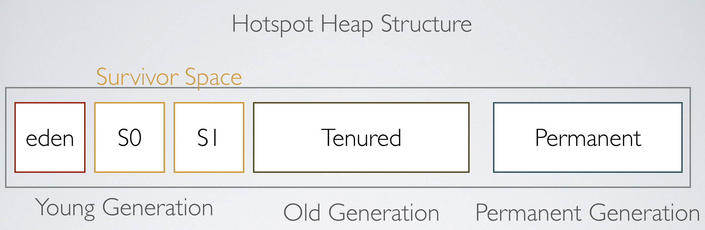

* * * 
# Garbage Collection, Collector(JAVA  중심)

Garbage Collection, 줄여서 GC라고도 불린다. 영어를 그대로 읽어서 가비지 컬렉션이라고 부른다. 메모리 관리 방법 중에 하나로, 시스템에서
더이상 사용하지 않는 동적 할당된 메모리 불럭을 찾아 잦동으로 다시 사용가능한 자원으로 회수하는 것으로 시스템에서 가비지컬렉션을 수행하는 부분을 가비지 컬렉터라고 한다.

가령 C언어는 프로그래머가 메모리를 할당한 뒤 수동으로 해제까지 직접해줘야 한다. 그래서 메모리를 할당해놓고, 메모리를 해제하지 않는다면, 메모리 누수가 생기거나, 거꾸로
해제했던 메모리를 다시 사용거나 하는 실수등 버그가 양산된다.

이러한 문제를 해결하기 위해서 제시한 것이 가비지 컬렉션이다. 이 가비지 컬렉션 기능을 채택한 언어의 경우에는 이 가비지 컬렉션에서 제공하는
할당과 해제를 이용하여 자동으로 프로그램이 실행되며 생기는 쓸모없어지는 메모리를 알아서 수집하고 관리해준다.

> 더이상 필요없어진 메모리를 쓰래기(Gargabe)라고 하고 이 쓰레기를 효과적으로 처리하는 작업을 GC(Garbage Collection)이라고 부른다.

GC 작업을 하는 가비지 콜렉터는 다음과 같은 역할을 한다.
1. 메모리 할당
2. 사용 중인 메모리 인식
3. 사용하지 않는 메모리 인식

즉, 메모리가 부족할 때 쓰레기를 정리해주는 프로그램을 가비지 컬렉터라고 부른다. 가비지 컬렉터에 대해서 알기 전에 우선 메모리에 대한 이해가 필요하다.
프로그램을 실행할 때 메모리르 관리하는 OS에 프로그램 실행에 필요한 메모리를 요청하게 된다. 이때 메모리를 어디에 저장할지 그 주소를 할당하는데 이 주소를
offset 주소라고 부른다.

이 할당된 메모리들은 프로그램이 돌아가면 필연적으로 '가비지'가 발생하게 된다. 기존에 가리키고 있던 메모리를 새롭게 선언되거나, 형병환이 되면서 다른 곳을
가르키게 되면서 주소를 잃어버리게 되고, 다시 찾을 수 없게 되면서 정리되지 않은 메모리가 생겨버린다.

그래서 가비지 컬렉터는 가비지를 다른 용도로 사용할 수 있도록 메모리를 해제시킨다. 이것이 가비지 컬렉터의 목적이다.

자바 기준으로 JVM은 메모리를 부여받고 프로그램을 실행하다가 메모리가 부족해지는 순간이 오면 추가적으로 메모리를 더 요청한다. 요청하는 항목이 바로 
가비지 컬렉터가 실행된다.

## Stop-The-World

Stop-The-World 는 GC 실행을 위해 JVM 이 애플리케이션 실행을 멈추는 것이다. 이 Stop-and-World가 발생하면, GC를 실행하는 쓰레드를 제외하는
나머지 쓰레드는 모두 작업을 멈춘다. 그래서 대부분의 경우 말하는 GC튜닝이란 이 Stop-the-World의 시간을 줄이는 것을 말한다.

GC의 과정을 Mark and Sweep이라고 부른다. 가비지 컬렉터가 닿을 수 있는 모든 변수나 객체들을 스켄하면서 어떤 객체를 가리키고 있는지 찾는 과정을
Mark라고 하고 이 과정에서 Stop-the-world가 발생한다. 이후 Mark 되어있지 않은 객체들을 힙에서 제거하는 과정이 Sweep이다.

## JVM의 heap 영억

</img>

JVM의 메모리는 크게 클래스 영억, 자바 스텍, 힙, 네이티브 메소드 스텍 이렇게 4개 영역으로 나뉜다. 가비지 콜렉터에서는 여기서 힙 메모리를 다루게 된다.
이 Heap은 Young, Old, Perm 또 다시 세 영역으로 나뉘게 되는데, Young 영역에서 발생한 GC를 Minor GC, 나머지 두 영역에서 발생한 GC를 Major GC(Full GC)라고
한다.

## Minor GC 와 Major GC

- Young 영역 : 새롭게 생성한 객체가 위치, 대부분 객체가 금방 닿을 수 없는 상태가 되기 때문에 많은 객체가 이 영역에 생성되었다가 사라진다.
- Old 영역 : Young 영역에서 참조할 수 있는 상태를 유지해 살아남은 객체가 여기로 복사. 대부분 Young영역보다 크게 할당하며 크기가 큰 만큼 Young영역보다
GC가 적게 발생한다.
- Perm 영역 : 클래스ㅡ와 메소드 정보와 같이 자바 언어 래밸에서는 거의 사용되지 않는 영역

## 객체의 이동 순서
일단 메모리에 객체가 생성되면, 위 사진의 Eden 영역에 객체가 지정된다. Eden 영역에 데이터가 어느정도 쌓이면 이 영역에 있던 객체가 다른 곳으로 
옮겨지거나 삭제된다. 이때 옮겨가는 위치가 바로 Survior Space라고 표시된 곳이다.

Survivor Space는 보통 두개의 영역이 있고 이 둘중에 우선순위ㅜ가 따로 정해져 있는 것이 아니라, 비어있는 곳에 지정되므로 둘 중에 한 개의 영역은 반드시
비어있어야한다. 그러다가 더 큰 객체가 생성되거나 더 이상 Young 영역에 공간이 남지 않으면 객체들은 Old영역으로 이동하게 된다.
- 객체 이동 순서 : Eden -> Survivor -> Old

## 가비지컬렉터의 한계
- 어떤 방식을 이용하던 실행 시간에 작업을 한다면 성능이 하락된다.
- 가비지컬렉터가 존재한다고 하덜다ㅗ 더이상 접근이 불가능 한 객체만 회수 하기 때문에 메모리 누수가 발생할 수 있다.