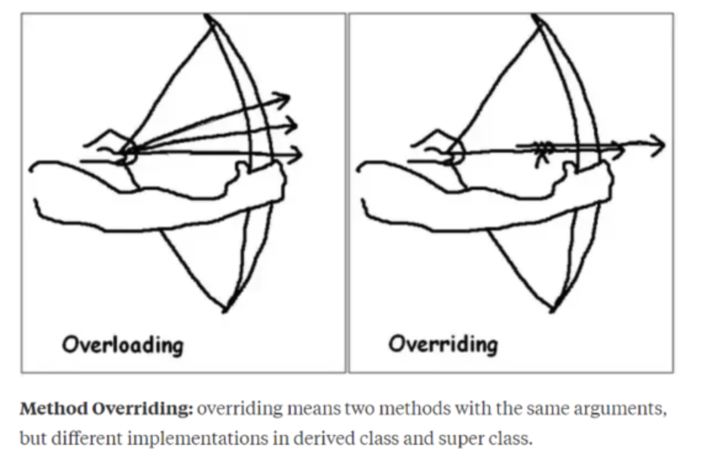

* * * 
# 오버로딩(Overloading)과 오버라이딩(Overriding)
객체 지향 프로그래밍에서 다형성을 설명할 때, 하나의 클래스 내부에 같은 이름의 기능을 여러 개 정의하거나, 상위 클래스의 기능을 하위 클래스에서 다시 정의하는
것, 즉 오버라이딩과 오버로딩에 대해서 간략하게 짚고 넘어갔었다면, 이번에는 오버라이딩과 오버로딩이 구체적으로 어떻게 사용되는지 또 어떤 차이점을 가지고 있는지에 대해서 알아보겠다.

우선 다형성이란 하나의 메소드나 클래스가 있을때, 다양한 방법으로 동작하는 것을 말한다. 예를 들어, 키보드나 스마트폰을 예를 들어보자면 키보드는 
버튼이 눌리는 일반적인 동작을 가지고 있더라도, ESC는 취소, Enter는 실행의 목적을 가지고 있다. 또 스마트폰 키패드 또한 문자나 게임 등에서
모양은 같지만 다른 동작을 수행한다.

* * *

## 오버로딩, Overloadinng
- 같은 이름의 메소드를 여러개 정의하는 것
- 매개 변수의 타입이 다르거나 갯수가 달라야한다. 
- return type과 제근 제어자는 영향을 주지 않는다. 

중요 포인트는, 오버로딩은 하나의 클래스에서 같은 이름의 메소드들을 여러 개 가질 수 있다는 점이다.
> Overloading은 print()함수들을 생각하자. 다양한 형태의 값을 넣어도 print는 결국 우리가 보이는 화면에 결과 값을 출력해준다.

## 오버라이딩, Overriding
- 상속에서 나온 개념
- 상위 클래스(부모 클래스)의 메소드를 하위 클래스(자식 클래스)에서 재정의

중요 포인트는 **상위 클래스의 메소드를 하위 클래스(자식 클래스)에서 재정의**한다는 점이다. 오버라이딩의 개념에 대해서 보충 설명을 한다면,
인터페이스에서 임시로 정의 했다가, implements 로 가져와 @Override로 재정의 하는 것이다.

다시말해 인터페이스에서 상위 클래스로 임시로 해당하는 메소드를 정의하고, 이를 오버라이딩으로 하위 클래스에서 재정의해서 사용한다. 

## Overloading과 Overriding의 차이

</img>

자 지금까지 오버로딩과 오버라이딩에 대해서 알아보았다. 이를 쉽게, 기억하기 위해 방법을 제시해보려고한다.

- 오버로딩 : println(), 매개변수의 형태가 다 다른 형태임을 기억하자.
- 오버라이딩: 라이딩 == 타다, 즉 위의 사진처럼 화살위에 또다른 화살을 태워서 보내는 것이다. 하지만 매개변수는 언제나 동일해야한다.