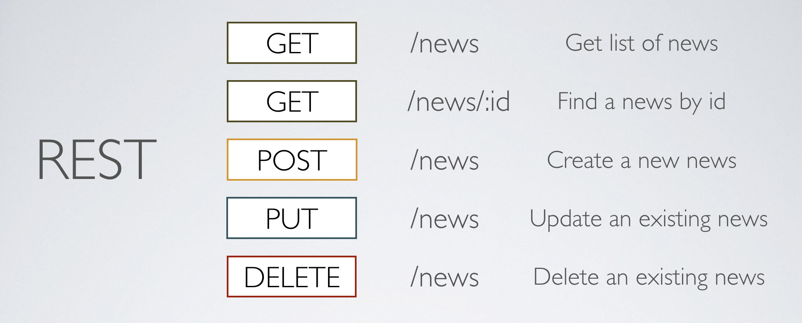
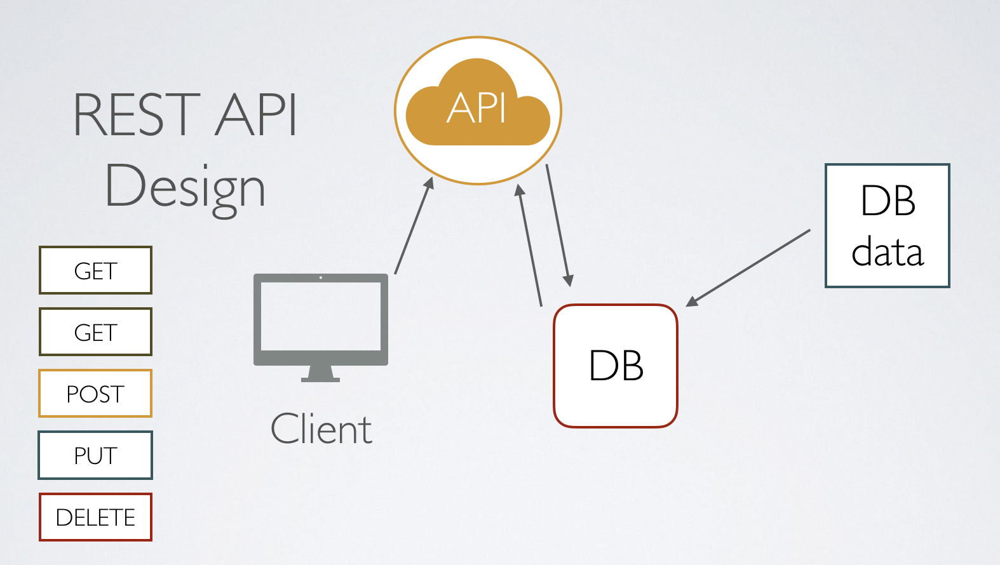

* * * 
# REST API

사실 REST API 를 이해하는데 가장 좋은 방법은 바로[이곳](https://slides.com/eungjun/rest#/) 혹은 '그런 REST API로 괜찮은가?'라는 제목의
영상을 한번 보고 공부하는 것을 추천한다.

</img>

REST 란 Representational State Transfer의 약자로써 풀어서 설명하자면 자원을 이름으로 구분해 해당 자원의 상태를 주고받는 것을 의미한다. 어떤 프레임워크가 
아니라 이런 방식을 가지고 자원을 주고받겠다는 약속이라는 의미에서 코딩 컨벤션과 같이한다.

> REST는 웹에서 존재하는 자원(Image, Video, DB etc)에 대해서 고유한 URI를 부여하고 활용하는 방법론을 의미한다.

REST는 기본적으로 웹의 기존 기술과 HTTP 프로토콜을 그대로 활용하기 때문에 웹의 장점을 최대한 활용할 수 있는 아키텍처 스타일이다. 이는 로이 필딩에 의해
최초로 박사학위 논문에 소개되며 정의되었고, 로이 필딩은 HTTP의 주요 저자 중 한 사람으로써 그 당시 웹 설계의 우수성에 비해 제대로 사용되어지지 않는 모습에
안타까워하며 최대한 웹의 장점을 활용할 수 있는 이 아키텍처를 발표했다.

</img>

## REST의 특징

Server-Client 구조
- 일반적인 인터페이스로 분리되어 있어야한다. 따라서 서로 간의 의존성이 줄어든다.
- 자원을 가진 쪽이 서버, 자원을 요청하는 쪽이 클라이언트가 된다.
- 흔히 말하는 백앤드, 프론트앤드를 나누는 기준이 된다.

Stateeless(무상태)
- 각 요청 간 클라이언트의 콘텍스트가 서버에 저장되어서는 안된다.
- HTTP 프로토콜의 장점을 극대화 하기 위한 방법이므로 REST 역시 HTTP 프로토콜처럼 Stateless Protocol의 성질을 갖는다.
- 세션 정보나 쿠키 정보를 별도로 저장하고 관리하지 않기 때문에 API서버는 클라이언트의 요청만을 단순 처리하면 된다. 즉, 서비스의 자유도가 높아지고 서버에서 불필요한 정보를
관리하지 않아 구현이 단순해지는 장점이 있다.

Cacheable(캐시 처리 기능)
- WWW에서와 같이 클라이언트는 응답을 캐싱할 수 있어야 한다.
- 잘 관리되는 캐싱은 클라이언트-서버간 상호 작용ㅇ을 부분적으로 또는 완전하게 제거하여 scalabitiy와 성능을 향상시킨다.
- 웹 표준 HTTP 프로토콜을 그래도 사용하므로 웹에서 사용하는 기존의 인프라를 그대로 활용할 수 있다.

Self-Descriptiveness(자체 표현 구조)
- REST API 메세지만 보고도 이를 쉽게 이해할 수 있도록 JSON을 이용해 직관적으로 이해가 가능한 자체 표현 구조로 되어있다.
- 동사(Method) +명사 (URI)로 이루어져 있으며 어떤 메서드에 무슨 행위를 하는지 알 수 있다.

계층형 구조
- REST 서버는 다중 계층으로 구성될 수 있으며, 보안, 로드밸런싱, 암호화 계층을 추가해 구조상의 유연성을 둘 수 있고, PROXY, Gateway 같은 네트워크
기반의 중간 매체를 사용할 수 있게한다.
- API 서버는 순수한 비즈니스 로직을 수행하고, 그 앞단에 보안, 로드밸런싱, 암호화, 사용자 인증 등을 추가하여 구조상의 유연성을 줄 수 있다. 

## REST의 구성

- 자원, Resource : URI 는 정보의 자원을 표현해야 한다.
- 행위, Verb : HTTP Method
- 표현 Representation of Resource : 자원에 대한 행위는 HTTP Method(GET, POST, PUT, DELETE)로 표현한다.

## REST의 목표
- 구성요소 상호작용의 규모확장성
- 인터페이스의 범용성
- 구성 요소의 독립적인 배포
- 중간적 구성요소를 이용해 응답 지연 감소, 보안을 강화, 레거시 시스템을 인캡슐레이션.

REST의 목표를 가지고 작업을 하게 된다면 백앤드와 프론트앤드의 영역을 효율적을 분리할 수 있어서 규모 확장에 있어서 장점이생기고 각자 독립적으로 배포되어
버전 관리를 할 수 있다.
자원과 직접적인 통신을 하고 있는 백앤드가 분리되어있기 때문에 접근하는 것에 있어서 자원을 캡슐화해서 보낼 수 있어서 보완도 강화되는 장점이 있다.

## REST API

그렇다면 이 REST에서 파생된 REST API는 어떤 것일까? 말 그대로 위에 나열된 REST 아키텍처를 준수해 설계된 API를 말한다. REST와RESTFUL을 동일한 
의미로 사용하는데 엄격학 ㅔ따지자면 서로 다른다.

최근 코로나 떄문에 이슈가 된 공공기고나 OPEN API나 Map API등을 제공하는 업체는 REST API 방식을 제공한다 .
그렇다면 어떻게 API는 자우너을 주고 받는 것일까? 가장 쉬운예가 URI 와 HTTP Method를 활용하는 것이 대표적인 예이다.

## URI 설계시 주의 사항

- 슬래쉬 ( / ) 는 계측 관계를 나타내는 것이다 ex) board/write 
- URI 마지막에는 / 를 사용하지 않는다. ex) board/write (o)  board/write/ (x)
- 하이픈( - )은 URI의 가독성을 높이는데 사용한다.
- 언더바( _ )는 URI에 사용하지 않는다.
- URI경로에는 되도록 소문자를 사용
- 파일확장자는 URI에 포함하지 않는다.

## HTTP METHOD

METHOD | ROLE
---|---
POST | POST를 통해 해당 URI를 요청하면 리소르를 생성
GET | GET을 통해 해당 리소스를 조회. 리소스를 조회하고 해당 도큐먼트에 대한 자세한 정보를 가져온다.
PUT | PUT을 통해 해당 리소스를 수정
PATCH | PATCH를 통해 해당 리소스를 수정
DELETE | DELETE를 통해 리소스를 삭제

보통은 값을 읽을때는 GET, 쓸때는 POST, 지울때는 DELETE 라고 생각해서 사용하거나 애매하다 싶으면 모두 POST로 던져버리는 무자비한 개발 방식이 많다.
하지만 그렇다면 진정으로 REST한 방식에 가깝다고 할 수 없다. 상황에 맞게, 상태에 맞게 자원을 관리해야한다. 그렇다면 어떻게 설계를 해야될까?

+ GET
    - 클라이언트에서 서버로 데이터를 전달할 때, 주소 뒤에 '이름'과 '값'(key, value)이 결합된 스트링 형태로 전달
    - 주소창에 있는 쿼리 스트링이 그대로 보여지기 때문에 보안성이 떨어진다.
    - 길이에 제한이 있다.(전송 데이터의 한계)
    - Post 방식보다 상대적으로 전송속도가 빠르다.
+ POST
    - 일정 크기 이상의 데이터를 보내야 할 때 사용한다.
    - 서버로 보내기 전에 인코딩을 하고 전송 후 서버에서 다시 디코딩이 이루어진다.
    - 주소창에 전송하는 데이터의 정보가 노출되지 않아 GET방식에 비해 보안성이 높다.
    - 속도가 GET방식에 비해 느리다.
    - 쿼리스트링 데이터 뿐만 아니라, 라디오 버튼, 텍스트 박스 같은 객체들의 값도 전송가능.

즉, GET 과 POST의 차이는
- GET은 주로 웹 브라우저가 웹 서버에 데이터를 요청할 때 사용.
- POST는 웹브라우저가 웹서버에 데이터를 전달하기 위해 사용.
- GET을 사용하면 웹 브라우저에서 웹서버로 전달되는 데이터가 인코딩되어 URL애 붙는다.
- POST 방식은 전달되는 데이터가 URL에 표시 되지 안흔다.
- GET 방식은 전달 되는 데이터가 255개의 문자를 초과하면 문제가 발생할 수 있다.
- 웹서버에 많은 데이터를 전달하기 위해서는 POST 방식을 사용하는 것이 좋다.

## PUT과 PATCH의 차이
PUT은 자원의 전체 교체 및 수정이 필요할 때 사용하고, PATCH는 자원의 일부만 수정되거나 교체될 때, 사용된다.
따라서 DB의 특정 칼럼만 수정하고자 한다면, PATCH를 사용, 전부를 교체한다면 PUT

## 응답 상태 코드 

상태코드 | 설명
---|---
200| 클라이언트의 요청을 정상적으로 수행
201 | 클라이언트가 어떠한 리소스 생성을 요청, 해당 리소스가 성공적으로 생성됨. POST를 통한 리소스 새성 작업
400 | 클라이언트가 부적절할 경우 사용하는 응답 코드
401 | 클라이언트가 인증되지 않은 상태에서 보호된 리소스를 요청했을 때 ex) 로그인하지않고 데이터 열람
403 | 유저 인증상태와 관계 없이 응답하고 싶지 않은 리소스를 클라이언트가 요청했을 때 사용하는 응답코드(403 보다는 400 or 404)
405 | 클라이언트가 요청한리소스에서는 사용 불가능한 메소드를 이용했을 경우 사용하는 응답 코드
301 | 클라이언트가 요청한 리소스에 대해새 URI가 변경 되었을 때 사용하는 응답코드
500 | 서버에 문제가 있을 경우 사용하는 응답코드