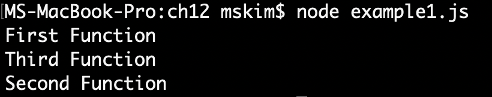
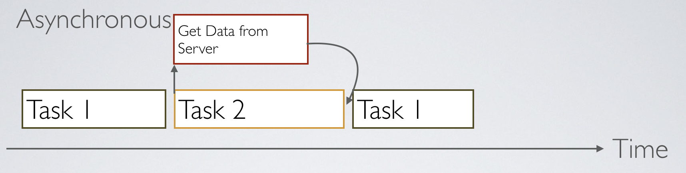
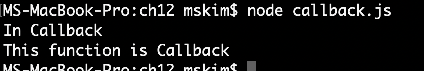

* * * 
# 동기와 비동기 (Synchronous & Asynchronous)

내가 서버사이드, 백앤드, Nodejs에 공부를 하며 제일 햇갈려했던 부분을 정리해보고자한다.

</img>

물론, 동기와 비동기 처리방식은 모든 언어에 공통적으로 사용되므로 동기와 비동기의 차이점을 분명히 하고 그 개념에 대해서 알아두면 좋다. 우선적으로
동기와 비동기 처리방식을 비유할 때, 커피 주문을 예로 든다. 흔히 카페에서 주문을 하려면 한줄로 서서 한명씩만 주문이 가능하다. 마치 Queue처럼
선입 선출의 과정으로 코드실행의 순서를 우리는 동기 방식이라고 부른다. 일단 주문이 들어가면 카페 내부의 점원들은 열심히 음료를 만든다. 이 때, 점원은
한명만 있는것이 아닌 여러명이 존재한다. 그렇다면, 주문받은 순서대로 일을 처리하는 것이 아니라 각자의 파트별로 음료를 나누어 만들어 먼저 완성된 음료가
나오게 된다. 이렇게 되면 1번,2번 순서대로 주문을 했더라도 2번의 음료가 먼저 완성 됬다면, 2번의 진동벨이 먼저 울리고 음료를 받아 갈 수 있다. 즉,
점원들은 비동기적으로 일을 처리한 것이다.

> 동기는 순차적, 직렬적으로 테스크를 수행하고, 비동기는 병렬적으로 테스크를 수행한다.

## 동기 Synchronous

프로그래머는 코드를 보는게 더 이해가 쉬울수도 있다.

<pre>

function func1(){
     console.log('First Function');
     func2();
 };
 
function func2(){
     console.log('Second Function');
     func3();
 };
 
function func3(){
     console.log('Third Function');
 };
 
 func1();

</pre>
<실행결과>

</img>

위의 실행결과를 보면 순차적으로 처리된 결과를 볼 수 있다. 즉, 동기적으로 처리되었다고 할 수 있다.

## 비동기 Asynchronous

우선, 비동기는 왜 필요할까? 만약 데이터를 서버로부터 받아오는 앱을 만든다고 가정하자. 서버로부터 데이터를 받아와서 해당 데이터를 뿌려줘야 하므로 맨 처음에
서버로 부터 데이터를 받아오는 코드가 실행되어야 할 것이다.

하지만 비동기로 처리하지 않고 동기적으로 이를 구성한다면, 데이터를 받아오기까지 기다린 다음에서야 앱이 실행될 것이다. 또한 서버에서 가져오는 데이터의 양이 늘어날수록
기하급수적으로 앱의 실행 속도는 느려지게 될 것이다. 데이터를 가져오기까지 앱이 대기하는 상태가 벌어지는 것이다. 이런 사용자들의 불편을 없애기 위해 데이터를 수신하는
코드와 페이지를 표시하는 것과는 비동기적으로 처리를 해야하는 것이다. 그래서 이 비동기처리코드의 예로 가장 많이 드는 것이 **setTimeout** 과 **AJAX**이다.

<pre>

function func1(){
    console.log('First Function');
    func2();
}

function func2(){
    setTimeout(function(){
        console.log('Second Function');
        }, 0);
        
    func3();
}

function func3(){
    console.log('Third Function');
};

func1();

</pre>

<실행결과>

</img>

하지만 우리가 알듯이, Javascript는 싱글 스레드로 동작한다. 멀티스레드 방식이 필연적인 비동기식으로 처리할 수 있는 것일까?

</img>

자바스크립트는 웹 브라우저나 Node.js의 자바스크립트 엔진에서 실행이 된다. 이 엔진에는 자바스크립트를 돌리는 하나의 스레드가 존재한다. 또한 이 엔진 뿐만아니라
비동기식 처리 모델 Web API라는 것이 함께 동작하면서 여기에 setTimeout이나 AJAX로 Http 데이터를 가져오는 시간이 소요되는 일들을 처리한다.

이 Web API들이 자바스크립트 엔진 스레드와는 따로 비동기 처리를 따로 돌면서 콜백함수를 가지고 이벤트 루프에 들어가 처리되는 대로 콜백함수를 다시 자바스크립트 엔진으로 돌려보내준다.

## Callback Function 콜백 함수 

> Callback Function는 특정 함수에 매개변수로 전달된 함수를 말한다.

<pre>
function Callback(callback){
    console.log('In Callback');
    callback();
    };
    
Callback(function(){
    console.log('This function is Callback');
    });    
    
</pre>

</img>

왜 Callback을 사용하는가? 만약 Callback Function에서 콜백을 받지 않는다면, 콜백 함수의 과정이 끝나기도 전에 다음 프로세스를 진행하게 되는 경우가 있다.
실제로 현업에서 DB 값을 읽어드리는 작업을 했는데, 콘솔에서 Undefined만 나오는 경우가 있다. ES7~ES8이 보편화 된 지금은 Promise 나 await 기능을 사용해서
많이 개선 되었지만, 예전에는 Callback Function을 이용해서 구현하는 것이 일반적이다.

Callback Function 을 지양하는 이유는 바로 가독성이다. 쉬운 예를 들어보자.

<pre>
function callback1(callback){
    function callback2(callbakc2){
        function callback3(callback3){
        ...
            ...
                function callbackN(callbackN){
                    console.log('Callback Function HELL!!!');
                    };
</pre>

흔히 실무자들이 말하는  callback 지옥에 빠질수 있다. 이 콜벡지옥은 가독성도 떨어지고, 코딩하는데 있어서 실수의 위험도 커지기 때문에 ES7에서는 다양한 방법으로
이를 해결할 수 있는 것들을 지원한다. ES7에서는 promise, ES8에서는 Async와 Await를 지원한다.

## Promise
Promise는 자바스크립트 비동기 처리에 사용되는 객체이다. 프로미스는 주로 서버에서 받아온 데이터를 화면에 표시할 때 사용한다.

<pre>

function dataFunction(data){
    return new Promise(function(resolve, reject){
        ajax(url + "info/" + data, function(response){
            resolve(response);
            });
        });
};
            
</pre>

서버에서 데이터를 가져오는 함수를 간단한 Promise함수를 구현했다. 이 Promise가 콜백을 구현하는 방식은 .then으로 여러개의 프로미스를 연결해서 사용할 수 있다.
이 메소드를 호출하면 새로운 Promise 객체가 반환된다. 계속 콜백을 받아서 다음 콜백으로 넘길 필요가 없이 데이터를 받아오길 기다렸다가 다음 함수를 실행하는 방식으로 이어서
실행된다.

<pre>
new Promise(function(resolve, reject){
    setTimeout(function(){
        resolve(1);
        }, 2000);
    })
    .then(function(result){
        console.log(result); // 1
        return result +10;
    })
    .then(function(result){
        console.log(result);
        return result +20;
    })
    .then(function(result){
        console.log(result);
    });            
</pre>
1을 받기를 기다렸다가, 10을 더하고 11을 받기를 기다렸다가, 20을 더하고, 마지막으로 31을 출력하게 된다. 비동기 작업을 순차적으로 처리를 할 수 있게 된것이다.
Callback Function 보다 훨씬 직관적이다. 하지만 polyfill등의 라이브러리 없이는 익스플로러에서 동작하지 않는다.(익스 왜씀?)

## Async / Await
ES8에서는 Async / Await를 지원한다. 프로미스로 제공하던 함수들을 더 간결하고 직관적이게 실행할 수 있게 됐다. C#이나 Dart같은 언어에서도 사용된다!

<pre>
async function getUserInfo(){
    let userInfo = await userCollection.find({});
    console.log("await 다음에 오는 콘솔",userInfo);
    }
</pre>

간단하게 Function 앞에 async를 붙이고, await란 코드를 달면 코드를 진행하다가 멈추고, await실행한 후에 다음 작업을 실행한다.
만약 await를 안붙인다면... undefine만 볼 수 있을 것이다.