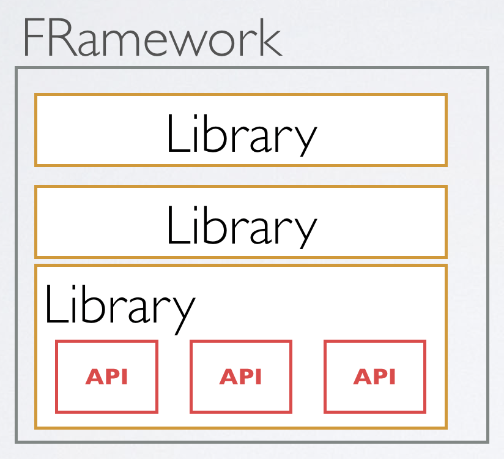

###### 모든 자료는[https://www.notion.so/54d624628a634c879cc93d94f54cd2d1#4ce2623b16fa46ea9622658e71bc930c]

* * * 
# 프레임워크와 라이브러리

* * *

## 프레임워크의 개요
프레임워크도 알고 있고, 라이브러리롣 알지만, 이둘의 차이점에 대해 잘 알지 못하는 경우가 많다고 한다. 
API를 모은 것이 라이브러리, 라이브러리들을 모은 것이 프레임워크가 된다고 쉽게 말할 수있지만 
사실은 그렇게 쉬운 문제가 아니다.

아래의 그림처럼 해석하는 분들이 많을 것이다.

단순히 API -> 라이브러리 -> 프레임워크  

실질적으로 객체지향 프로그램 개발에 투입되는 인력들이 늘어남에 따라 다양성이 증가되고, 결과적으로 "전체 시스템의 통합성 및 일관성이 부족하게 되었다."
이를 해결하기 위해 개발자들의 자유를 억압하는 대신, 갖추어진 틀안에서 일관된 보수 및 개발을 할 수 있는 환경인 "프레임워크(Framework)"가 등장하게 되었따.

## 프레임 워크란?
> 기본적인 뼈대(backbone) 이 완성되어 있고 규칙이 존재하는 개발 환경

예를 들어, 자동차의 기초적인 뼈대가 존재 한다면, 이 뼈대를 기초로하여 여러가지의 종류의 자동차를 만드는 것이다.(세단, 쿠페, SUV 등등...)
만약 프레임이 4WD프레임이라면 목적은 오프로드 차량이나 SUV를 의도하는 것이므로 차량을 개발할때 제약사항이 생긴다.

뼈대의 역할 == 프레임 워크

외형적인 장식, 유리창, 내장장식 == 라이브러리

특정한 틀을 만들어 놓고, 그곳에 블록을 조립함으로써 프로그램을 만들 때의 작업시간을 획기적으로 줄여주는 것이다. 이를 **스켈레톤코드(Skeleton code)** 라한다.
스켈레톤 코드(Skeleton Code)는 이미 어느정도 완성된 코드로, 의도에 따라 변형하여 와성하는 함수 또는 클래스를 의미한다.

프레임워크의 특징
1. 개발자들이 따라야할 가이드라인이 정해져있다.
2. 개발할 수 있는 범위가 정해져 있다.
3. 개발자를 위한 다양한 도구들이 지원된다.

프레임워크 사용의 장 단점

| 프레임워크의 장점 및 단점 |  | | | |
:---:| :--- | :--- | :--- | :--- | 
장점 | 개발의 편의성이 좋다 |  개발 시간이 단축된다 | 어느정도의 코드품질이 보장 | 유지 및 보수에 용이
단점 | 프레임워크의 의존도 증가로 개발 능력 저하 | 개발자의 자유도 감소

## 라이브러리의 개요
프로그래밍을 하게 되면서 공통적으로 반복적으로 사용하는 기능들에 대해 새로 알고리즘을 만들거나 새로 코딩할 필요 없이, 모듈화된 코드를 가져다 쓰는 것이 훨씬 간편하고
안정적이라는 인식이 생겨나면서 만들어졌다.

## 라이브러리란?
> 개발시 활용가능한 도구들을 모듈화한 것

여러 회사들 중에 잘 만든 네비게이션이나 라디오가 있다고 하자. 그렇다면 우리는 하나하나 라디오나 네비게이션을 처음부터 만드는 것이 아니라, 만드는 자동차에 
이미 만들어진 네비게이션이나 라디오를 원하는곳에 설치하면 된다.

## 라이브러리와 API 의 차이점
여기서  API(Application Programming Interface)랑 햇갈릴 수 가 있는데, 라이브러리는 실제로 실행이 되는 기능을 담당한느 단편화된 프로그램이고, API는 다른 목적으로
개발된 프로그램/라이브러리 들의 특정 기능을 호출하기 위해서 인터페이스를 노출시킨 것이 API이다. **따라서 특정한 부분만을 수행하며, API자체를 사용자가 직접적인 조작이 불가능하다. 예를 들어
네이버지도를 직접적으로 코드를 변형하는 조작 등을 할 수 없지만, API를 통해 간접적으로 일정한 기능을 호출할 수 있다.**

## 프레임워크와 라이브러리의 차이점
앞서 두가지의 개념을 살펴봐도, 명확한 차이점을 찾기는 힘들다. 하지만 확실한 것은 프레임워크는 단순한 라이브러리의 집합은 아닌 것이다.